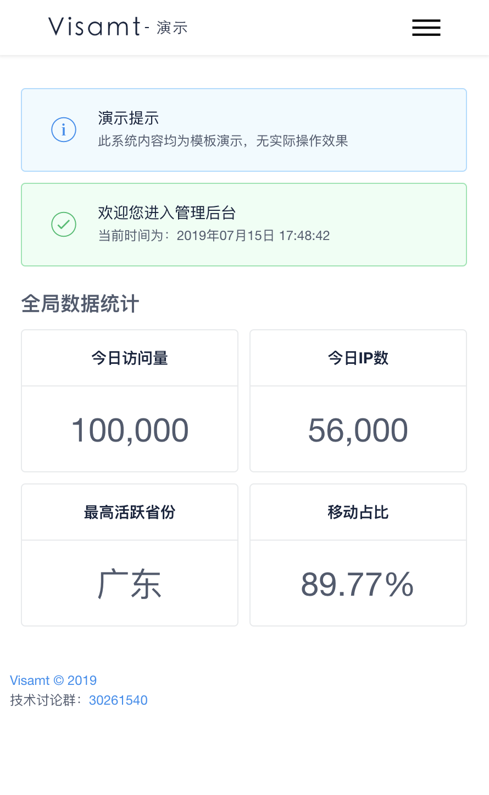

# visamt
> visamt = vue-iview-self-adaption-manage-template

Vue+iView的一套自适应后台管理基础模板

# 演示

## PC端

## 移动端

# 交流讨论
QQ群：30261540

[点我快捷加入QQ群讨论](https://shang.qq.com/wpa/qunwpa?idkey=c3541f1d0dbe443456228e3aebf23f6795b614a94d5df6a32f0b2b1c759bb99b)

